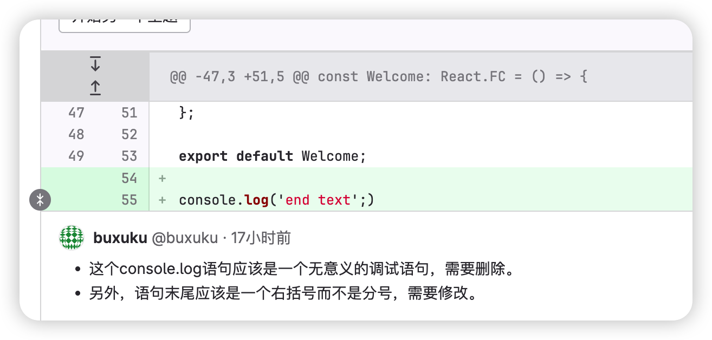

# @buxuku/ai-code-reviewer

## 介绍



`@buxuku/ai-code-reviewer` 是一款应用于 GitLab Merge Request 代码审查的小工具，支持调用私有化部署的 GitLab API，并使用 OpenAI API 获取审查结果。请注意，在使用它时，需要确保符合公司合规要求。😉


## 特点

- 🛠️ 支持配置 GitLab API 地址
- 🌍 支持配置 OpenAI 代理 API 地址，解决国内可能无法访问 OpenAI API 的问题
- 🆔 支持配置 OpenAI 组织 ID
- ⚙️ 支持配置多个 OpenAI API Key 实现接口调用的负载均衡（多个 Key 以逗号分隔）
- 🚦 超过速率限制时，自动等待并重试
- 💬 审查结果以评论的方式追加到对应的代码块所在位置


## 安装

```sh
npm i @buxuku/ai-code-reviewer
`````

## 使用

### 通过 Shell 脚本使用

```shell
Usage: ai-code-reviewer [options]

Options:
  -g, --gitlab-api-url <string>       GitLab API URL (default: " https://gitlab.com/api/v4")
  -t, --gitlab-access-token <string>  GitLab Access Token
  -o, --openai-api-url <string>       OpenAI API URL (default: "https://api.openai.com")
  -a, --openai-access-token <string>  OpenAI Access Token
  -p, --project-id <number>           GitLab Project ID
  -m, --merge-request-id <string>     GitLab Merge Request ID
  -org, --organization-id <number>    organization ID
  -h, --help                          display help for command
```

示例:

```sh
ai-code-reviewer -g https://gitlab.com/api/v4 -t glpat-xxxxxxx -o https://api.openai.com -a skxxxxxxx,skxxxxxxx -p 432288 -m 8
```

### 在 CI 中使用

在 GitLab CI/CD 中设置 `GITLAB_TOKEN` 和 `CHATGPT_KEY` 变量，`.gitlab-ci.yml` 如下：

```yml
stages:
  - merge-request

Code Review:
  stage: merge-request  
  image: node:latest
  script:
    - npm i @buxuku/ai-code-reviewer -g
    - ai-code-reviewer -t "$GITLAB_TOKEN" -a "$CHATGPT_KEY"  -p "$CI_MERGE_REQUEST_PROJECT_ID" -m "$CI_MERGE_REQUEST_IID"
  only:
    - merge_requests
  when: on_success
```

## 贡献
欢迎贡献代码，提出问题和建议！👏

## 许可证
本项目基于 MIT 许可证。详细信息请参见 LICENSE 文件。📜